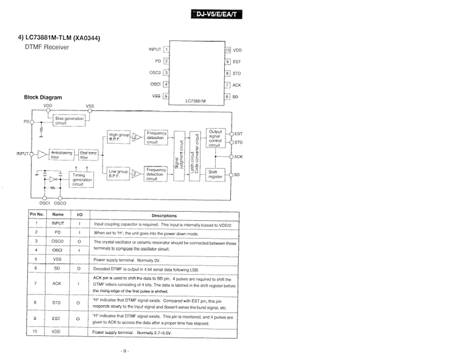
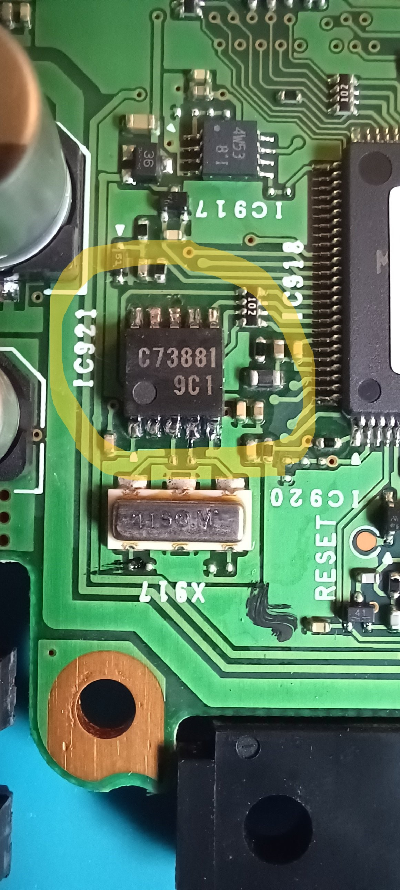
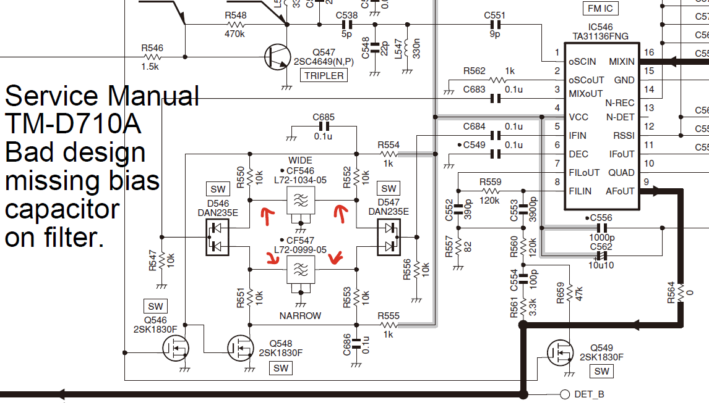
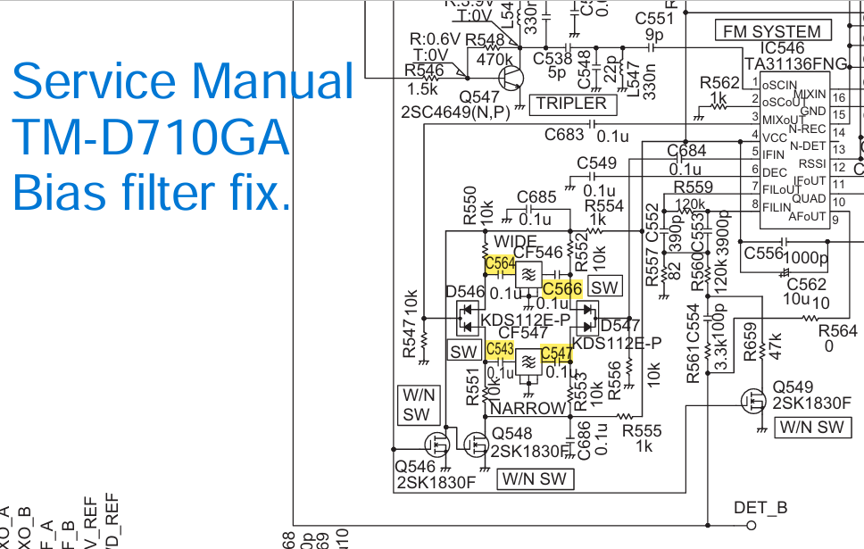
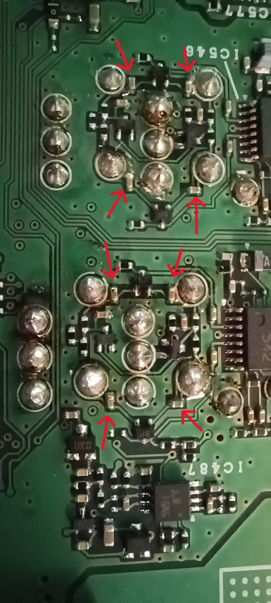

# Kenwood TM-D710GA
Restoring DTMF decode capabilities for remote control cross-band repeater.

Manuals in these newer radios have notes about wireless operation being unavailable in serials B8610081 and up for the V71A and B8610001 and up for the 710GA.

I have an old Alinco HT DJ-V5 after looking at the service manual I noticed that it has the ic (dtmf decoder) I desoldered the ic and took the chance to solder it in my Kenwood TM-D710G rig, the result is conclusive the menu 923 and 924 is appeared as if by magic, I put the radio in remote mode (REV + POWER ON).

YES YES YES !!!! Good News it working !!!

https://forums.qrz.com/index.php?threads/restoring-dtmf-decode-capabilities-to-kenwood-tm-v71a-and-tm-d710ga-radios.779383/

https://www.youtube.com/watch?v=FMVq9n76n2E&t=2s

TM-D710GA Audio PCB

TM-D710GA Audio PCB

# IF Filter Bias

Kenwood fix the design (TM-D710GA) (on my rig good news)
add capacitor to remove voltage bias on if filter pin.

https://sv8ym.blogspot.com/2010/07/mysterious-case-of-withering-filters.html?fbclid=IwY2xjawKXYKdleHRuA2FlbQIxMABicmlkETEyM3JTUzdTcFpsRnlwdXpCAR4LgATvSXCBZfFxxZ-Y7gjBiO5Q4KDCzu5qKQw3LJ08vP704-cwwP8FPrCk8A_aem_fnu4HLnc1__Jov_xRa5TrQ

# Kenwood TM-D710A

# Kenwood TM-D710GA (GPS on board)

